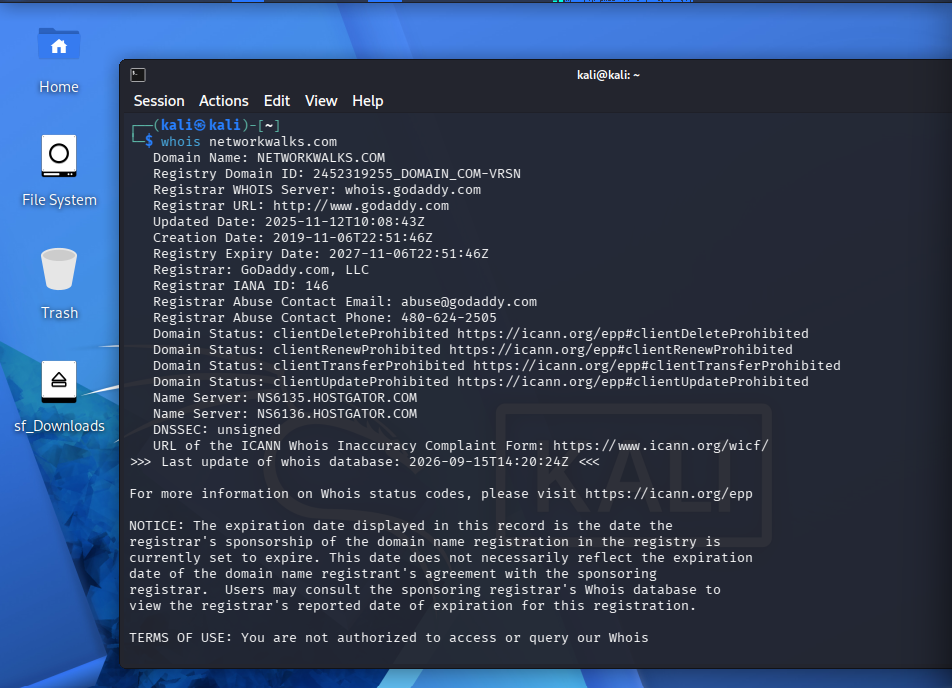
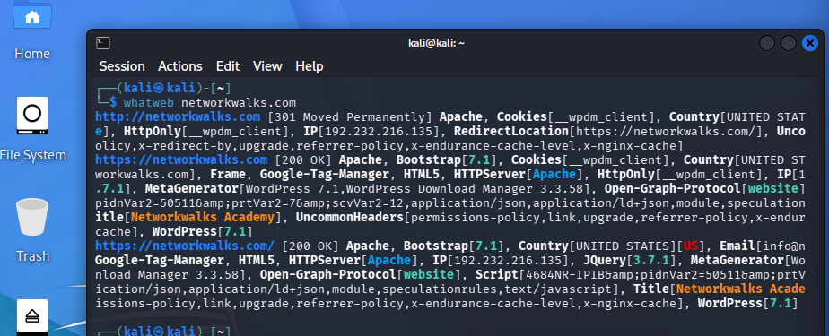
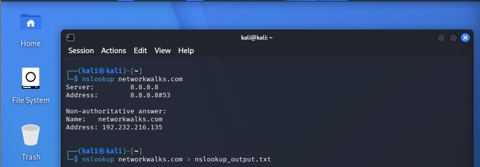
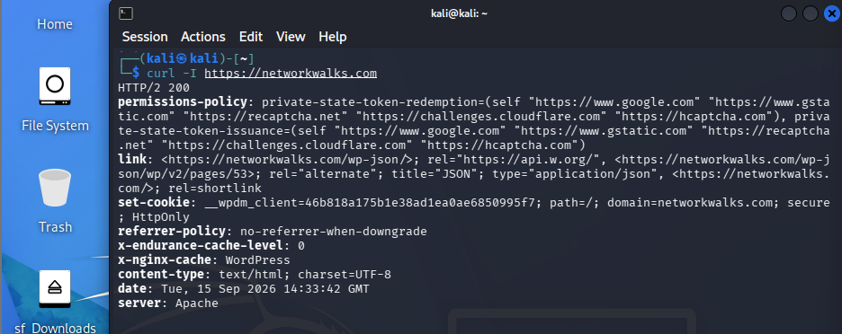
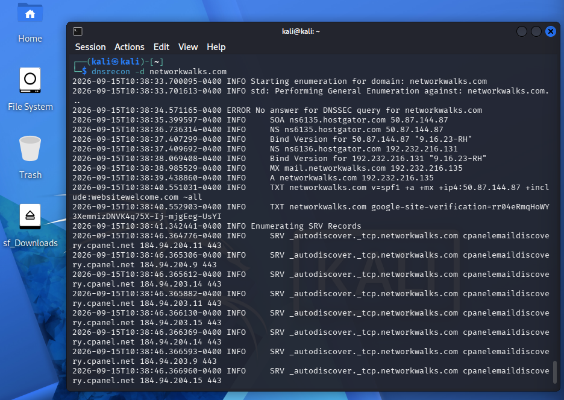
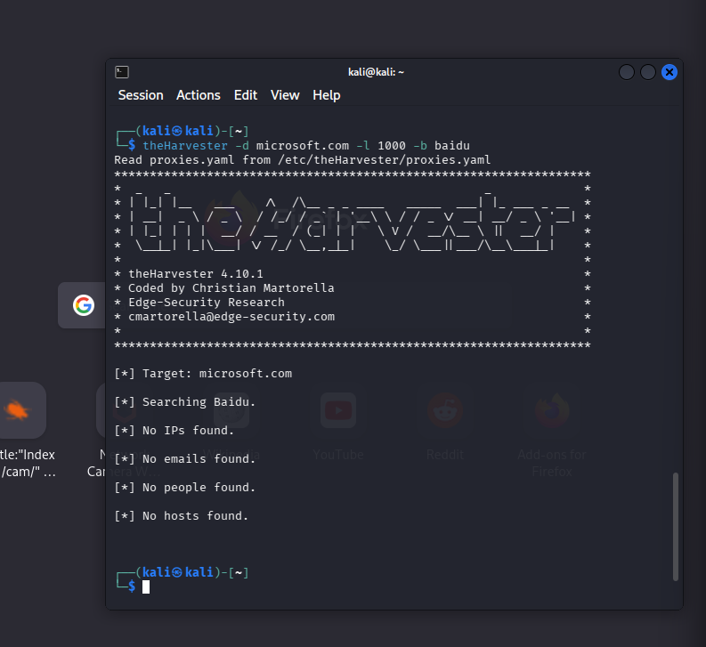
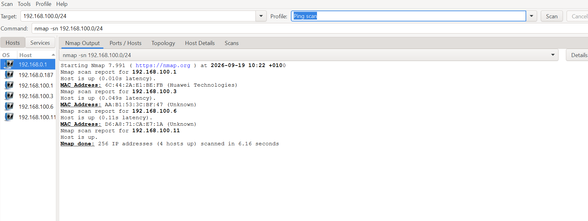

# NETWORKWALKS-OLUWATOMIWA-B083-WK2
**Modules Completed:** W2-PM1 (Footprinting Tools), W2-PM2 (GHDB), W2-PM5 (Zenmap Scanning)  
**Scope Authorization:** NW-LOA-B082-017  

---

## 📌 Overview
During Week 2, I performed practical exercises covering **Phase 1: Reconnaissance & Footprinting** and **Phase 2: Scanning & Network Discovery**. 

All activities were conducted under strict written authorization to analyze public metadata leakage, test search engine reconnaissance techniques, and perform local network host discovery.

---

## ⚖️ Legal & Authorization Scope
* **Letter of Authorization:** Reference `NW-LOA-B082-017`
* **Target 1:** `networkwalks.com` (Authorized passive footprinting and light information gathering)
* **Target 2:** `192.168.100.0/24` (Local area network owned and controlled by the tester)
* **Rules of Engagement:** Strictly non-destructive. No exploitation, DoS, brute-force attacks, or data modification were performed.

---

## 🛠️ Tools Used
* **Operating Systems:** Kali Linux & Windows
* **Footprinting & Reconnaissance:** WHOIS, WhatWeb, Nslookup, cURL, Wafw00f, DNSRecon, theHarvester
* **OSINT Search:** Google Hacking Database (GHDB)
* **Network Scanning:** Zenmap (Nmap GUI)

---

## 🔬 Practical Execution & Evidence

### 1. Domain Registration Profiling (`whois`)
Queried domain registration details to identify registrar information and authoritative name servers.
* **Target:** `networkwalks.com`
* **Registrar:** GoDaddy.com, LLC
* **Name Servers:** `NS6135.HOSTGATOR.COM`, `NS6136.HOSTGATOR.COM`



---

### 2. Web Technology Fingerprinting (`whatweb`)
Analyzed web technologies, software frameworks, and plugins exposed by the web server.
* **CMS:** WordPress 7.1
* **Web Server:** Apache
* **Plugins / Libraries:** WP Download Manager 3.3.58, Bootstrap 7.1, jQuery 3.7.1



---

### 3. DNS Resolution (`nslookup`)
Resolved the domain name to its public-facing IP endpoint.
* **Command:** `nslookup networkwalks.com`
* **Resolved IP Address:** `192.232.216.135`



---

### 4. HTTP Header Inspection (`curl -I`)
Inspected HTTP response headers to view caching layers, server software, and exposed endpoints.
* **Protocol & Status:** HTTP/2 200
* **Identified Headers:** `server: Apache`, `x-nginx-cache: WordPress`, REST API link `<https://networkwalks.com/wp-json/>`



---

### 5. DNS Infrastructure Enumeration (`dnsrecon`)
Enumerated DNS records including Name Servers, Mail Exchange (MX), SPF/TXT records, and service autodiscovery.
* **BIND Version Exposed:** `9.16.23-RH` on nameserver `50.87.144.87`
* **MX Record:** `mail.networkwalks.com` (`192.232.216.135`)
* **SRV Records:** cPanel autodiscover endpoints (`_autodiscover._tcp.networkwalks.com`)



---

### 6. Public Intelligence Harvesting (`theHarvester`)
Tested OSINT workflows using search engine collectors (such as Baidu) to check for publicly indexed emails, subdomains, and hostnames.



---

### 7. Google Hacking Database / Dorking (Module W2-PM2)
Applied advanced Google search operators to analyze how misconfigurations cause sensitive interfaces and directories to be indexed publicly:
* **Exposed Camera Interfaces:** Evaluated search queries such as `intitle:"webcamXP" inurl:8080` and `intitle:"webcam 7" inurl:/gallery.html`.
* **Open Directory Listings:** Identified unindexed file repositories exposing documents and PDFs using `intitle:index.of "parent directory" mathematics pdf`.

---

### 8. Network Discovery & Host Sweeps (`Zenmap`)
Performed a non-intrusive Ping Scan (`nmap -sn 192.168.100.0/24`) across the local subnet to identify active endpoints without port scanning.
* **Hosts Up:** 4 active hosts discovered in 6.16 seconds.
  * `192.168.100.1` — Gateway (MAC: `6C:44:2A:E1:BE:FB`, Huawei Technologies)
  * `192.168.100.3` — Active Host (MAC: `AA:B1:53:3C:BF:47`)
  * `192.168.100.6` — Active Host (MAC: `D6:A8:71:CA:E7:1A`)
  * `192.168.100.11` — Scanning Interface Host



#### Network Topology Visualization
Generated and exported a radial network topology showing the relationship of local nodes to `localhost`.


---

## 🛡️ Risk Analysis & Recommendations

| Finding / Observation | Potential Security Risk | Recommended Remediation |
| :--- | :--- | :--- |
| **Exposed CMS & Plugin Versions** | Attackers can search for known CVEs affecting specific WordPress/plugin builds. | Suppress version tags in source templates and maintain regular patch cycles. |
| **BIND Version Exposure** | Disclosing `9.16.23-RH` assists in software-specific targeting. | Obscure DNS software versions by editing `version.bind` in named configuration. |
| **Detailed HTTP Response Headers** | Discloses server daemon (Apache) and REST API paths (`/wp-json/`). | Disable server signatures (`ServerTokens Prod`, `ServerSignature Off`). |
| **Open Directory Indexing (GHDB)** | Unprotected web folders expose sensitive files directly to search engine crawlers. | Disable directory browsing (`Options -Indexes` in Apache or `autoindex off` in Nginx). |
| **Local Network Device Visibility** | Unidentified hosts could indicate rogue or unauthorized devices. | Implement Network Access Control (802.1X) and periodic subnet auditing. |

---

---

## 📑 Project Deliverables & Reports
All official signed letters, technical reports, and research tables for Week 2 are available in the [`documents/`](documents/) directory:

* 📄 [**Letter of Authorization (NW-LOA-B082-017)**](documents/W2-PM-Permission-Letter.pdf) — Signed client testing permission and scope boundaries.
* 📄 [**Final Penetration Testing Report**](documents/W2-PM-FINAL-Report.pdf) — Complete technical findings, executive summary, risk analysis, and defensive recommendations.
* 📄 [**GHDB & OSINT Dorking Tables (W2-PM2)**](documents/W2-PM2-GHDB-Tables.pdf) — Documented Google dorks, exposed interface links, and open directory findings.

---

## 📁 Repository Structure
```text
├── documents/
│   ├── W2-PM-Permission-Letter.pdf
│   ├── W2-PM-FINAL-Report.pdf
│   └── W2-PM2-GHDB-Tables.pdf
├── screenshots/
│   ├── 01-whois.png
│   ├── 02-whatweb.png
│   ├── 03-nslookup.png
│   ├── 04-curl.png
│   ├── 05-dnsrecon.png
│   ├── 06-harvester.png
│   ├── 07-zenmap-scan.png
│   └── 08-zenmap-topology.png
└── README.md
